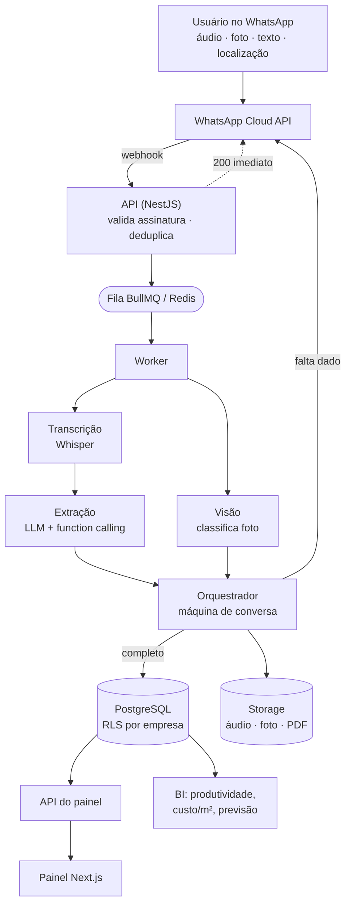

# Arquitetura

## O problema que define o desenho

O gargalo não é falta de sistema — é que ninguém preenche o sistema. Todo o
desenho decorre disso: a captura precisa acontecer no canteiro, por voz, em
segundos, e o resto do sistema se alimenta desse registro.

Duas restrições moldam a estrutura técnica:

1. **A Meta espera resposta do webhook em poucos segundos.** Transcrever áudio
   leva mais que isso. Logo, ingestão e processamento são obrigatoriamente
   separados por uma fila.
2. **O dado do RDO tem valor técnico e às vezes jurídico.** Logo, a IA nunca
   inventa: o que falta é perguntado, e a extração bruta fica auditável.

---

## Visão geral



---

## Decisões e o porquê

### API e worker são processos separados

Perfis de carga opostos. O webhook é leve, constante e não pode atrasar; a
transcrição é pesada, chega em rajada no fim do expediente e tolera latência.
Escalar juntos desperdiçaria recurso dos dois lados.

```bash
docker compose up -d --scale worker=3
```

### Isolamento multi-tenant no banco, não no código

Toda tabela de negócio tem `empresa_id` e uma policy de Row-Level Security. A
aplicação executa `SET LOCAL app.empresa_id` ao abrir a transação
(`DatabaseService.comTenant`).

O ganho é que esquecer um `WHERE empresa_id` deixa de ser vazamento de dados de
outro cliente e passa a ser, no máximo, uma consulta que não devolve nada.
Isolamento que depende de disciplina humana falha em algum lugar.

`SET LOCAL` (e não `SET`) é essencial: o valor morre com a transação, então a
conexão volta ao pool sem carregar o tenant anterior.

> **Pré-condição que anula tudo isso se ignorada:** superusuário do PostgreSQL
> ignora RLS. A aplicação precisa conectar como `obraia_app` (papel comum,
> criado na migration 002), nunca como o usuário de `POSTGRES_USER`, que é
> superusuário na imagem oficial. `SELECT * FROM verificar_isolamento();`
> confirma. Está no checklist de `docs/DEPLOY.md` porque é uma falha silenciosa:
> nada quebra, os dados apenas deixam de ser isolados.

**Exceção deliberada:** o webhook chega com um telefone e nenhum tenant. A
função `resolver_usuario_por_telefone` roda como `SECURITY DEFINER` e devolve
apenas `(usuario_id, empresa_id, nome, perfil)`. É a única porta sem escopo, e
ela é estreita de propósito.

### A extração é function calling, não texto livre

O LLM devolve um objeto validado por schema (`src/ai/esquema.ts`), não prosa
para o sistema parsear. Isso dá:

- persistência direta, sem parsing frágil;
- `campos_pendentes`, que é o mecanismo formal da pergunta de volta;
- rastreabilidade — o JSON bruto fica em `registros_voz.entidades`.

Temperatura em 0.1: extração é tarefa determinística. Criatividade aqui seria
exatamente o defeito a evitar.

> **Nota de robustez:** campos opcionais usam `.nullish().default(null)`, não
> `.nullable()`. O function schema marca poucos campos como obrigatórios, então
> o modelo legitimamente omite o que não se aplica; exigir a chave presente
> descartaria extrações boas. Ausente e `null` significam a mesma coisa aqui:
> não foi dito. (Há teste de regressão para isso.)

### Estado de conversa com validade

Registro de obra raramente cabe numa mensagem. O contexto guarda o rascunho e
as pendências (`conversas.contexto`, JSONB) e expira em 30 minutos — encaixar a
resposta de hoje num rascunho de ontem produziria um RDO errado e difícil de
rastrear.

### Idempotência na entrada

A Meta reentrega o payload quando não recebe 200 a tempo. `SET NX` no Redis
garante que o mesmo áudio não vire dois lançamentos no RDO.

### Um RDO por obra por dia

Constraint `UNIQUE (obra_id, data)`. Vários áudios ao longo do dia — o
comportamento real do canteiro — se acumulam no mesmo relatório em vez de
gerarem documentos concorrentes.

### Estoque só se move com quantidade

Material citado sem número não movimenta saldo. Chutar destruiria a confiança
no dado que decide compra. O item entra no RDO; o estoque espera.

---

## Camadas do código

```
apps/api/src/
├── config/       validação de ambiente (falha na subida, não em produção)
├── database/     pool + isolamento por tenant
├── whatsapp/     webhook, assinatura, cliente da Cloud API
├── queue/        produtor (API) e consumidor (worker)
├── ai/           esquema, transcrição, extração, visão, provedor
├── conversa/     máquina de estado + orquestrador
├── rdo/          repositório do relatório
├── estoque/      baixa, alerta e pedido de compra
├── bi/           indicadores, curva S, alertas
├── relatorios/   geração de PDF
└── auth/         JWT do painel
```

O provedor de IA é injetado por token (`PROVEDOR_IA`), não por classe concreta
— trocar de modelo ou dublar nos testes não toca em nenhum serviço de domínio.

---

## Segurança

| Vetor | Mitigação |
|---|---|
| Webhook forjado | HMAC-SHA256 do corpo bruto, comparado em tempo constante |
| Vazamento entre clientes | Row-Level Security com `FORCE`, tenant vindo do token |
| SQL injection | Queries parametrizadas em toda a base; nenhuma concatenação |
| Força bruta no login | Throttle de 5 tentativas/min; mensagem única para email/senha |
| Enumeração de contas | Resposta idêntica para email inexistente e senha errada |
| XSS / clickjacking | Helmet com CSP em produção |
| Payload malicioso | `ValidationPipe` com `whitelist`; validação de tipo e tamanho de mídia |
| Vazamento de stack | Filtro global: 5xx completo no log, resumido na resposta |

**Ponto de extensão previsto:** varredura de malware na mídia recebida. O local
natural é `StorageService.salvar`, antes de persistir — hoje há validação de
tipo e tamanho, mas não análise de conteúdo.

<a id="lgpd"></a>
## LGPD

O sistema trata voz, imagem, localização e nomes de funcionários citados em
áudio. Isso foi considerado no desenho, não depois:

- **Isolamento**: RLS por empresa no banco.
- **Retenção**: `MEDIA_RETENTION_DAYS` controla o descarte de áudio e imagem
  originais; a transcrição e o RDO permanecem (são o documento técnico).
- **Auditoria**: tabela `auditoria` registra acesso e alteração.
- **Rastreabilidade**: `registros_voz` guarda o áudio, a transcrição e o que a
  IA extraiu — se um RDO for contestado, dá para provar a origem do dado.
- **Minimização**: o histórico de conversa guarda 6 turnos, não a conversa toda.

Pendências antes de operar comercialmente: base legal e consentimento no
onboarding, política de privacidade, e processo de atendimento a titular
(acesso, correção e exclusão).

---

## Limites conhecidos

Ditos explicitamente para não serem descobertos em produção:

- **Previsão de término é extrapolação linear** do ritmo observado. Com poucos
  meses de dado, um modelo mais elaborado daria falsa precisão. Serve para
  disparar atenção, não para substituir planejamento.
- **A comparação de evolução por foto** depende de embeddings (pgvector). O
  schema cria a coluna condicionalmente; sem a extensão, a classificação de
  foto continua funcionando, a comparação não.
- **Janela de 24h da Meta**: mensagens proativas fora dela exigem template
  aprovado. `enviarTemplate` existe separado por isso.
- **Custo de IA por áudio** é o principal componente de custo variável. O
  limitador do worker (30 jobs/min) é o controle grosso; medir custo por obra é
  trabalho pendente.
